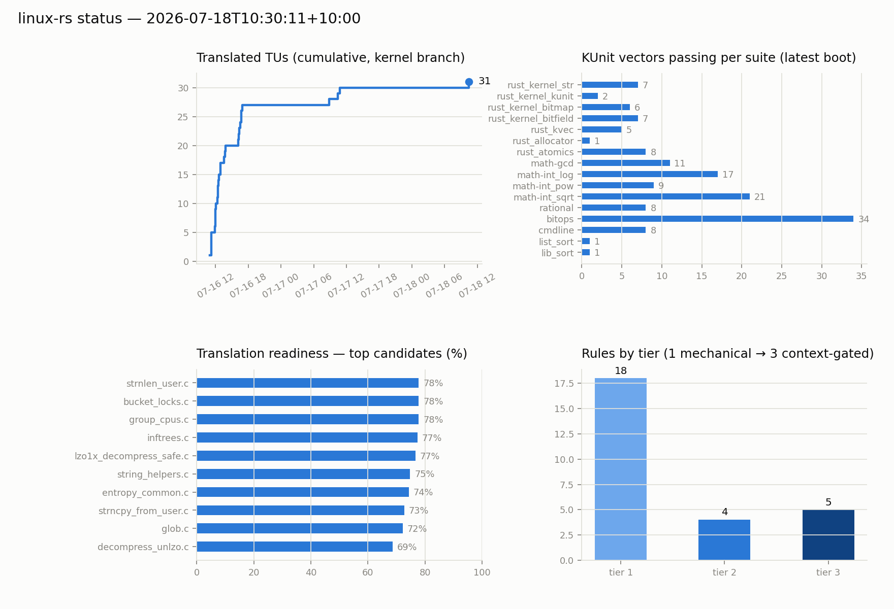

# Status — 2026-07-18T10:30:11+10:00

- Translated TUs: **31**   ·   KUnit: **16 suites, 143 vectors** green   ·   Rules: **27** (t1 18 / t2 4 / t3 5)

## KUnit (latest boot)

| suite | vectors |
|---|---|
| rust_kernel_str | 7 |
| rust_kernel_kunit | 2 |
| rust_kernel_bitmap | 6 |
| rust_kernel_bitfield | 7 |
| rust_kvec | 5 |
| rust_allocator | 1 |
| rust_atomics | 8 |
| math-gcd | 11 |
| math-int_log | 17 |
| math-int_pow | 9 |
| math-int_sqrt | 21 |
| rational | 8 |
| bitops | 34 |
| cmdline | 8 |
| list_sort | 1 |
| lib_sort | 1 |

## Next candidates by readiness

| TU | readiness |
|---|---|
| lib/strnlen_user.c | 77.8% |
| lib/bucket_locks.c | 77.8% |
| lib/group_cpus.c | 77.8% |
| lib/zlib_inflate/inftrees.c | 77.4% |
| lib/lzo/lzo1x_decompress_safe.c | 76.7% |
| lib/string_helpers.c | 74.8% |
| lib/zstd/common/entropy_common.c | 74.4% |
| lib/strncpy_from_user.c | 72.7% |
| lib/glob.c | 72.2% |
| lib/decompress_unlzo.c | 68.6% |

_Auto-generated by `scripts/report.py` (via `dev.py check`); history in [status/history.csv](status/history.csv)._
