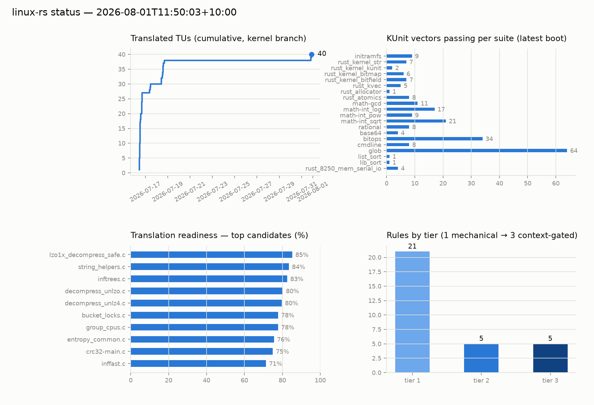

# Status — 2026-08-02T13:39:10+10:00

- Translated TUs: **41** (**41 hand** — bridge, tracked for transpiler replacement · **0 c2rust**)   ·   KUnit: **20 suites, 224 vectors** green   ·   Rules: **31** (t1 21 / t2 5 / t3 5)
- Wired into live boot path: **6 functions across 1 file(s)** (vs. **41** total TUs landed) — see [docs/streams.md](streams.md)'s stream 2 ("c2rust-boot-blocker") for why this is the harder, more important milestone: a standalone `lib/` swap compiling clean is not the same as real Rust executing at a live, pre-existing C call site.

## Boot-path integration patterns (live-derived, not hand-maintained)

| pattern | count | detection |
|---|---|---|
| In-place wired (`#ifdef CONFIG_RUST` C wrapper calls a `*_rs` fn) | **6 fns / 1 file(s)** | regex scan of `linux-riscv/**/*.c` for `#ifdef CONFIG_RUST` blocks calling a `*_rs(...)` function |
| Whole-file `lib/` swap (Makefile points straight at `*_rs.rs`, no call-site wrapper) | **41** | `*_rs.rs` TUs whose sibling `.c` (if any) has no `#ifdef CONFIG_RUST` wrapper calling into it |

Wired functions (detail)

| file | functions |
|---|---|
| `drivers/tty/serial/8250/8250_port.c` | bytes_to_fcr_rxtrig, fcr_get_rxtrig_bytes, serial8250_compute_lcr, serial8250_do_shutdown, serial8250_do_startup, serial8250_handle_irq_locked |

## Hand-translated files (bridge, tracked for replacement)

Every file here is hand-written Rust, not transpiler output — a visible, tracked bridge (see [docs/streams.md](streams.md)'s stream 4), replaced with real `awtoau/c2rust` output as the transpiler catches up.

| C file | replacement issue |
|---|---|
| `drivers/tty/serial/8250/8250_helpers.c` | awto-au/linux-rs#96 |
| `drivers/tty/serial/8250/8250_io.c` | awto-au/linux-rs#73 |
| `drivers/tty/serial/8250/8250_irq.c` | awto-au/linux-rs#87 |
| `drivers/tty/serial/8250/8250_startup.c` | awto-au/linux-rs#82 |
| `lib/argv_split.c` | awto-au/linux-rs#88 |
| `lib/base64.c` | awto-au/linux-rs#57 |
| `lib/bcd.c` | awto-au/linux-rs#70 |
| `lib/bitmap-str.c` | awto-au/linux-rs#60 |
| `lib/bitmap.c` | awto-au/linux-rs#76 |
| `lib/checksum.c` | awto-au/linux-rs#86 |
| `lib/cmdline.c` | awto-au/linux-rs#58 |
| `lib/ctype.c` | awto-au/linux-rs#90 |
| `lib/decompress.c` | awto-au/linux-rs#89 |
| `lib/earlycpio.c` | awto-au/linux-rs#94 |
| `lib/find_bit.c` | awto-au/linux-rs#78 |
| `lib/glob.c` | awto-au/linux-rs#84 |
| `lib/hexdump.c` | awto-au/linux-rs#65 |
| `lib/hweight.c` | awto-au/linux-rs#64 |
| `lib/iomem_copy.c` | awto-au/linux-rs#85 |
| `lib/kstrtox.c` | awto-au/linux-rs#68 |
| `lib/list_sort.c` | awto-au/linux-rs#67 |
| `lib/llist.c` | awto-au/linux-rs#79 |
| `lib/math/div64.c` | awto-au/linux-rs#71 |
| `lib/math/gcd.c` | awto-au/linux-rs#69 |
| `lib/math/int_log.c` | awto-au/linux-rs#83 |
| `lib/math/int_pow.c` | awto-au/linux-rs#92 |
| `lib/math/int_sqrt.c` | awto-au/linux-rs#91 |
| `lib/math/lcm.c` | awto-au/linux-rs#66 |
| `lib/math/rational.c` | awto-au/linux-rs#97 |
| `lib/math/reciprocal_div.c` | awto-au/linux-rs#81 |
| `lib/memcat_p.c` | awto-au/linux-rs#63 |
| `lib/memweight.c` | awto-au/linux-rs#72 |
| `lib/parser.c` | awto-au/linux-rs#93 |
| `lib/sort.c` | awto-au/linux-rs#77 |
| `lib/string.c` | awto-au/linux-rs#95 |
| `lib/strncpy_from_user.c` | awto-au/linux-rs#62 |
| `lib/strnlen_user.c` | awto-au/linux-rs#59 |
| `lib/ucs2_string.c` | awto-au/linux-rs#80 |
| `lib/usercopy.c` | awto-au/linux-rs#61 |
| `lib/win_minmax.c` | awto-au/linux-rs#75 |
| `lib/zstd/common/error_private.c` | awto-au/linux-rs#74 |

## KUnit (latest boot)

| suite | vectors |
|---|---|
| initramfs | 9 |
| rust_kernel_str | 7 |
| rust_kernel_kunit | 2 |
| rust_kernel_bitmap | 6 |
| rust_kernel_bitfield | 7 |
| rust_kvec | 5 |
| rust_allocator | 1 |
| rust_atomics | 8 |
| math-gcd | 11 |
| math-int_log | 17 |
| math-int_pow | 9 |
| math-int_sqrt | 21 |
| rational | 8 |
| base64 | 4 |
| bitops | 34 |
| cmdline | 8 |
| glob | 64 |
| list_sort | 1 |
| lib_sort | 1 |
| rust_8250_mem_serial_io | 4 |

## Next candidates by readiness

| TU | readiness |
|---|---|
| lib/lzo/lzo1x_decompress_safe.c | 85.3% |
| lib/string_helpers.c | 83.5% |
| lib/zlib_inflate/inftrees.c | 82.6% |
| lib/decompress_unlzo.c | 80.3% |
| lib/decompress_unlz4.c | 79.8% |
| lib/bucket_locks.c | 77.8% |
| lib/group_cpus.c | 77.8% |
| lib/zstd/common/entropy_common.c | 75.6% |
| lib/crc/crc32-main.c | 75.0% |
| lib/zlib_inflate/inffast.c | 71.4% |

_Auto-generated by `scripts/report.py` (via `dev.py check`); history in [status/history.csv](status/history.csv)._
