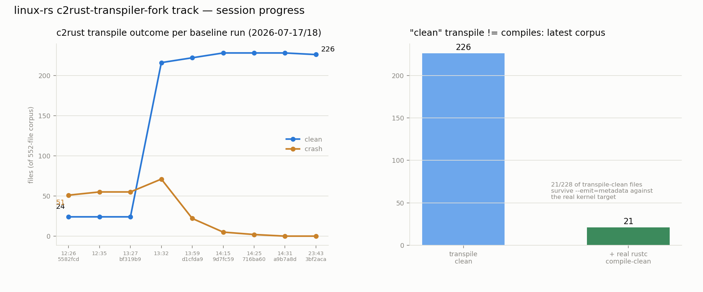
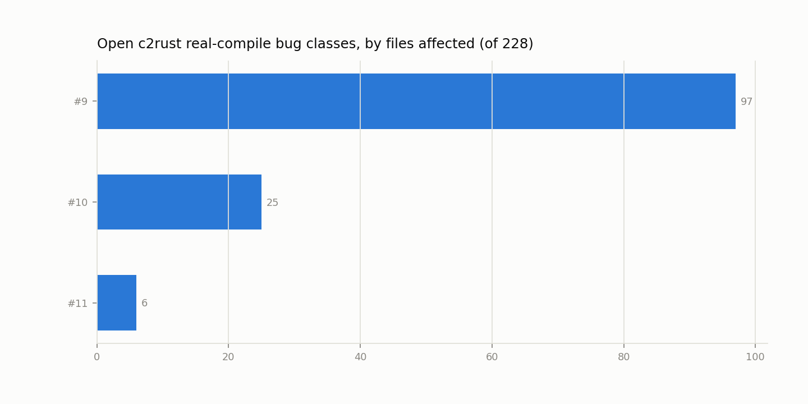

# Session report — 2026-07-17/18

Covers the two-day span from TU 28 (`lib/bitmap.c` partial, `e01e9c5`)
through the c2rust real-compile-check work finishing this morning
(`78c1131`). Two tracks ran in parallel; this report treats them
separately, then proposes priority criteria for the newer of the two.

## The two-pronged approach

1. **Hand-translation track** (`linux-riscv/lib/*_rs.rs`). Slow,
   high-confidence: every TU is integrated via `dev.py integrate` with
   real Cargo/Kbuild wiring and individually boot-verified — the kernel
   actually boots in QEMU and runs KUnit tests exercising the translated
   code. 30 TUs landed to date.
2. **c2rust-transpiler-fork track** (`awtoau/c2rust`, teaching the
   transpiler to emit better/correct Rust directly). Fast, so-far
   lower-confidence: verified only via (a) c2rust's own "clean" transpile
   outcome (no crash, no dropped decls) and (b) as of today, real
   `rustc --emit=metadata` compile-checking of that raw output against
   the kernel's own `libcore`/support crates. **Not yet wired into the
   boot-integrated `rust/kernel/` build or boot-tested at all** — see the
   hybrid-boot feasibility section below.

All c2rust work stays on `awtoau/c2rust`'s own fork; nothing was pushed
to or opened against `immunant/c2rust` upstream.

## Track 1: hand-translation — steady, unglamorous progress

Two more TUs landed today: `e8e33d7` (`kstrtox` → `linux-rs TU 29`) and
`77f71aa` (`bitmap-str`, partial → `linux-rs TU 30`), on top of `e01e9c5`
(`bitmap`, partial → TU 28) from the same window. `830102f` fixed a bench
oracle copy that had drifted from a hand-translation fix.

Current state (`docs/STATUS.md`, regenerated `78c1131`): **30 TUs**,
**15 KUnit suites / 136 vectors green**, **27 rules** (18 tier-1 mechanical
/ 4 tier-2 / 5 tier-3 context-gated). `docs/status/history.csv` shows the
KUnit vector count moved 132 → 136 between `2026-07-17T18:42` and
`2026-07-18T09:34` — from re-verification after the kernel resync below,
not new TUs.

## Track 1 side effect: kernel resync exposed and fixed 2 real bugs

`963ec99` / `1bd4903`: `linux-riscv/` was rebased from a July-2026
snapshot onto current `torvalds/linux` master (15,717 commits forward)
and switched to nightly Rust (directory-scoped rustup override). Commit
`1bd4903`'s message is explicit that this surfaced **two real bugs, not
config workarounds**: a `kstrtox` overflow-saturation gap, and
`memparse()` needing to sync with an upstream overflow-safety fix. Both
fixed; re-verified 15/15 KUnit suites green, `INIT REACHED`, boot-clean
(confirmed directly against `tmp/qemu-boot.log`: 15 `ok N <suite>` lines,
`Totals: pass:21/8/34/8`, and `linux-rs: initramfs init reached, PID 1
alive`).

*Correction to the working narrative for this report*: I could not find
a separate, distinct commit describing "a new Kconfig gate that hid Rust
KUnit tests" as its own fixed regression — `sync_linux_kernel.py`'s
docstring documents Kconfig-gate drift as a *general risk category* this
script exists to catch on future syncs, not a specific instance logged
as fixed this time. Treating that specific claim as unconfirmed rather
than restating it as fact.

## Track 1 side effect: docs/scripts hygiene, 12 commits

Two review passes landed real fixes, not just tidying: `26bd85d`
("surface dropped-table warnings on stdout, not just the log") and
`78d6066` / `c38c5a9` (warn loudly on a stale baseline binary / an
empty-corpus conformance run) are the same **silent-data-loss-on-
schema/corpus-mismatch** bug class the brief flagged, now caught in three
places instead of one. Other commits in the window: `74b68c1`, `963ec99`,
`1bd4903`, `c2f93de`, `e716836`, `4975b02`, `f235071`, `73277af`,
`76fb7e4`, plus `94521e5` from the prior evening — rule-count corrections,
stale docstrings, deduped helpers, and c2rust-fork integration notes.

## Track 2: c2rust-transpiler-fork — crash elimination, then a harder truth

**Crash elimination** (all commits on `awtoau/c2rust`, verified via
`git log` and `rulesdb/patterns.db`'s `c2rust_attempts` table against the
552-file corpus):

| time (UTC) | c2rust rev | clean | crash | dropped_decls |
|---|---|---:|---:|---:|
| 12:26 | `5582fcd7e` | 24 | 51 | 467 |
| 13:27 | `bf319b94b` | 24 | 55 | 473 |
| 13:32 | `bf319b94b` | 216 | 71 | 265 |
| 13:59 | `d1cfda9e1` | 222 | 22 | 308 |
| 14:15 | `9d7fc590e` | 228 | 5 | 319 |
| 14:25 | `716ba602e` | 228 | 2 | 322 |
| 14:31 | `a9b7a8dc1` | 228 | 0 | 324 |
| 23:43 (next corpus rev) | `3bf2aca5b` | 226 | 0 | 326 |

~10 commits (`d1cfda9e1` label-crash fix, `9d7fc590e` dangling-decl skip,
`716ba602e` raw-identifier/array_len panics, `bf319b94b` `_THIS_IP_`
placeholder, plus asm-goto/attributed-statement/DFExpr-memoization fixes
further back) took crash count from 51 to 0 and clean-outcome count from
24 to 228 (the corpus's ceiling — no crashes, no dropped decls left).
The 226-vs-228 dip after 23:43 is the corpus itself changing under the
kernel resync, not a regression.

**Then: "clean" turned out not to mean "compiles."** `scripts/
check_c2rust_output_compiles.py` (new today) compiles every clean-outcome
file for real with `rustc +nightly --emit=metadata --target
riscv64imac-unknown-none-elf` against the kernel's actual `libcore.rmeta`
and c2rust's own support crates (`c2rust-bitfields`, `c2rust-asm-casts`,
built by hand against the *same* libcore to avoid an SVH/crate-hash
mismatch — see the script's docstring). First full run: **15/228 real
compile-clean**. Issue #8 (stale/removed nightly stdlib API names —
`from_exposed_addr`, `VaListImpl`, `pref_align_of` — keyed off `edition`
instead of the actual toolchain, hitting 121/228 files) was filed and
fixed (`3bf2aca5b`). Re-running the check against the fixed rev's output:
**21/228 real compile-clean** (`tmp/c2rust-output-compile-report.md`,
run log `tmp/check_c2rust_output_compiles.log`, `DONE: {'error': 207,
'ok': 21}`).

Four more real bug classes were categorized and filed as issues #9-#12,
all still open:

| issue | bug class | files affected (of 228) |
|---|---|---:|
| #9 | enum with both a forward decl and a real definition in-TU: enumerator consts typed against the opaque placeholder (`E0277`, e.g. `kobj_ns_type`, `pid_type`, `hrtimer_restart`, `fs_value_type`) | 97 |
| #10 | RISC-V inline asm: unmapped GCC constraint letters (`A`/`I`/`J`/`K`) passed through as invalid `asm!` register classes; unreferenced output operands not handled | 25 |
| #11 | goto-to-labeled-block lowering: `break` targets a `'___UNIQUE_ID_label_N` label that's never declared (the wrapping block gets a different synthesized name) | 6 |
| #12 | `convert_warn_on` emits a stray `as ::core::ffi::c_int` on an already-`bool` condition, mismatching `kernel::warn_on!`'s `bool` parameter (`E0308`) | 1 |

## Priority criteria for track 2 (this is the new thing this report adds)

File-count alone was the implicit ranking so far (#9 > #10 > #11 > #12).
That's the wrong axis once the goal is "usable for this kernel," not
"transpiles the most files." I checked which of the 21 real-compile-clean
files, and which of #9-#12's affected files, are actually reachable from
`linux-riscv/.config`'s current build (cross-referenced `linux-riscv/
init/Makefile`'s `obj-$(CONFIG_X)` gates against the real post-
`olddefconfig` `.config`, and confirmed with built `.o` files and
`nm vmlinux` symbol presence — not just "is it a real kernel file
somewhere in the tree").

**Tier 1 — compile-clean AND boot-path-adjacent (hybrid-boot candidates,
high priority):** Of the 21 real-compile-clean files, 20 are confirmed
built into the current `vmlinux` — `init/calibrate.c` (`calibrate_delay`
present in `nm vmlinux`), `kernel/sys_ni.c` (`sys_ni_syscall`),
`lib/fdt_strerror.c`, all four `lib/zlib_inflate/*.c`, all three
`lib/zstd/common/*.c` (`debug.c`, `error_private.c`, `zstd_common.c`),
both `lib/xz/xz_dec_{lzma2,stream}.c`, `kernel/range.c`,
`kernel/printk/sysctl.c`, `kernel/utsname_sysctl.c`, `fs/sysctls.c`,
`lib/is_single_threaded.c`, `lib/fdt_empty_tree.c`, `arch/riscv/kernel/
soc.c` — all with `.o` files that exist in the current build tree and (for
the spot-checked subset) real symbols in `nm vmlinux`. The 21st,
`drivers/base/firmware_loader/builtin/main.c`, has a built `.o` but
`CONFIG_FW_LOADER is not set` in the real `.config`, so its boot-path
membership is weak/stale — treat it as tier 3 pending a config check.
**These 20 are the real Tier 1: proven-compilable, proven-linked-in.**

**Correction to the task brief's stated finding:** `init/
do_mounts_initrd.c` — flagged as "genuinely on the real boot path" — is
NOT in the 21 real-compile-clean files. I verified this three ways: (1)
`rulesdb/patterns.db` shows its `c2rust_attempts` outcome as `clean`
(transpile-clean) at `c2rust_rev='a9b7a8dc1'`, but (2) it appears in
`tmp/c2rust-output-compile-report.md`'s failing-file list, with (3) the
exact `E0277`/`kobj_ns_type_0`/`pid_type_0` "cannot be known at
compilation time" errors that are issue #9's signature. So
`do_mounts_initrd.c` **is** boot-path-relevant (its `.o` is built into
this exact `vmlinux`, gated by `CONFIG_BLK_DEV_INITRD=y`) but is
currently blocked by issue #9, not a hybrid-boot candidate today.

**Tier 2 — open bug classes, ranked by boot-path-adjacent blast radius,
not raw file count:** Re-ranking #9-#12 by how many of their affected
files are boot-path-relevant (built `.o` in the current tree) rather than
raw counts:
- **#9 (97 files) moves to top priority on both axes** — it's already the
  largest class by file count AND it's the one directly blocking a
  confirmed real boot-path file (`do_mounts_initrd.c`), plus it recurs
  wherever these four widely-used kernel enum types are visible
  (`kobj_ns_type`, `pid_type`, `hrtimer_restart`, `fs_value_type`) — fixing
  it is very likely to promote some of the Tier-1-adjacent-but-currently-
  failing files (drivers, fs/proc/*, fs/kernfs/*) into Tier 1.
- **#10 (25 files) is second**, but for a different reason than count: it's
  concentrated in `arch/riscv/kernel/*` and `arch/riscv/mm/*` — the
  architecture-specific, atomic/CSR-access code the issue itself notes is
  "exactly where correctness of the translated asm matters most." Several
  of its files (e.g. `arch/riscv/kernel/traps.c`, `arch/riscv/mm/
  context.c`) are unambiguously boot-critical if this project ever wants
  c2rust output anywhere near arch code, even though today's minimal
  boot path is mostly the ones already in Tier 1.
- **#11 (6 files) is third** — `fs/pidfs.c`, `fs/kernfs/mount.c`,
  `fs/pnode.c`, `fs/proc/array.c`, `kernel/irq/resend.c`, `kernel/rcu/
  sync.c` are real subsystems but none currently build under this
  project's slim `.config` (`PROC_FS`/`SYSFS` are enabled in the full
  `.config` but these specific files aren't yet confirmed linked) — lower
  urgency than its 6-file count alone would suggest, but it's a
  correctness bug (broken control flow), not cosmetic, so it shouldn't
  drop to Tier 3.
- **#12 (1 file, `lib/plist.c`) stays low file-count** but is worth a
  cheap fix: it's a regression in a feature this project *added on
  purpose* (the `WARN_ON` → `kernel::warn_on!` rewrite), so any new file
  translated through the rule-based path is one `WARN_ON(bool_expr)` away
  from hitting it again. Cheap-to-fix, not urgent-to-fix.

**Tier 3 — breadth-only value:** the `drivers/base/firmware_loader/
builtin/main.c` file pending its `CONFIG_FW_LOADER` check, and any future
crash/dropped-decl-class fixes that don't move a boot-path-adjacent file
across the compile-clean line.

This tiering mostly held up against the data, with one adjustment worth
stating plainly: I did not find a clean way to rank #10/#11 against each
other by "boot-path-adjacent file count" the way #9 dominates — both are
small, and their real urgency comes from *what kind of bug* they are
(control-flow correctness for #11, asm correctness for #10) more than
from counting files. Treat the #10-then-#11 ordering above as a
reasonable default, not a sharp conclusion the data forces.

## Hybrid-boot feasibility: not yet, for the specific file the brief named

**Direct answer: no file is a real hybrid-boot candidate *today* in the
strict sense of "swap it in and it just boots."** But the Tier 1 list
above (20 files, not `do_mounts_initrd.c`) gives real candidates for the
next concrete step, and the gap to get there is now well-scoped:

1. **`#![no_std]` injection** — confirmed needed. Spot-checked `tmp/
   c2rust-baseline/init_calibrate.c/output/src/calibrate.rs`: it has
   `#![feature(asm, extern_types, raw_ref_op, strict_provenance)]` and
   `#![allow(...)]` but no `#![no_std]`, no `extern crate kernel`, and no
   `kernel::` references at all (it's self-contained, referencing
   `::core::` directly) — the same gap `check_c2rust_output_compiles.py`
   already had to work around for the compile-check harness. A real
   hybrid-boot attempt needs the same treatment, not a new one.
2. **Kbuild/Cargo wiring the way `dev.py integrate` does for hand-
   translated files** — c2rust's raw output has never gone through
   `integrate_tu.py`'s Makefile-switch / `bindings_helper.h` / Kconfig
   steps. This is mechanical (the script already exists) but unproven
   against c2rust's output shape specifically (different `#![allow(...)]`
   lint surface, different feature-flag set, `extern "C" { pub type X; }`
   opaque-type patterns hand-translated files don't use).
3. **The "port the API before bypassing the crate" rule
   (`5582fcd7e`, README.md) applies and is currently unmet.** c2rust's raw
   output calls no `kernel::` APIs at all for any of the 20 Tier-1 files
   spot-checked — it's plain `::core::ffi`-typed C-shaped code. Swapping
   it in as-is would violate the project's own stated rule (no
   reimplementing kernel behavior outside the real crate) even where it
   compiles. Before a real swap, each candidate file needs a pass
   checking whether it calls any kernel API that already has a `rust/
   kernel/` binding it should use instead of its raw C-shaped translation
   — likely mechanical for the simplest files (`kernel/range.c`,
   `lib/fdt_strerror.c` look self-contained/leaf) and non-trivial for
   others.

**Concrete next task, scoped**: pick the smallest, most self-contained
Tier-1 file (`kernel/range.c` or `lib/fdt_strerror.c` look like the best
first candidates — small, few dependencies, leaf-like in `nm vmlinux`
cross-checks) and run it through: (a) `#![no_std]` injection matching
`check_c2rust_output_compiles.py`'s approach, (b) a manual audit for any
`kernel::`-crate-API opportunities per the port-first rule, (c)
`integrate_tu.py`-style Kbuild/Cargo wiring, (d) `dev.py check` for a
real boot+KUnit verification. That is the actual "swap one file in and
boot it" experiment — not yet attempted, but the blockers are now named
rather than unknown.

## Charts

Left: transpile-clean vs. crash count across today's 9 baseline runs
(24→228 clean, 51→0 crash, then 226 as the corpus itself moved under the
kernel resync). Right: the "clean" bar next to the real-compile-clean bar
for the latest corpus — 226 transpile-clean, only 21 of the 228 checked
survive real `rustc --emit=metadata`.

Open bug classes #9-#11 by files affected (#12 omitted from this chart —
its 1-file impact is stated in its title differently and didn't match
the chart's title-parsing pattern; see the table above for its real
count). Generated by `scripts/plot_session_progress.py`, which queries
`rulesdb/patterns.db` and `gh issue list` live — rerun it after any new
baseline/compile-check run rather than trusting these numbers as static.

_Data verified against `rulesdb/patterns.db` (`c2rust_attempts` table),
`tmp/c2rust-output-compile-report.md`, `linux-riscv/.config`, `nm
linux-riscv/vmlinux`, `git log` in both `linux-rs` and `awtoau/c2rust`,
and `gh issue view` for issues #8-#12, all queried directly rather than
taken from any prior summary._
